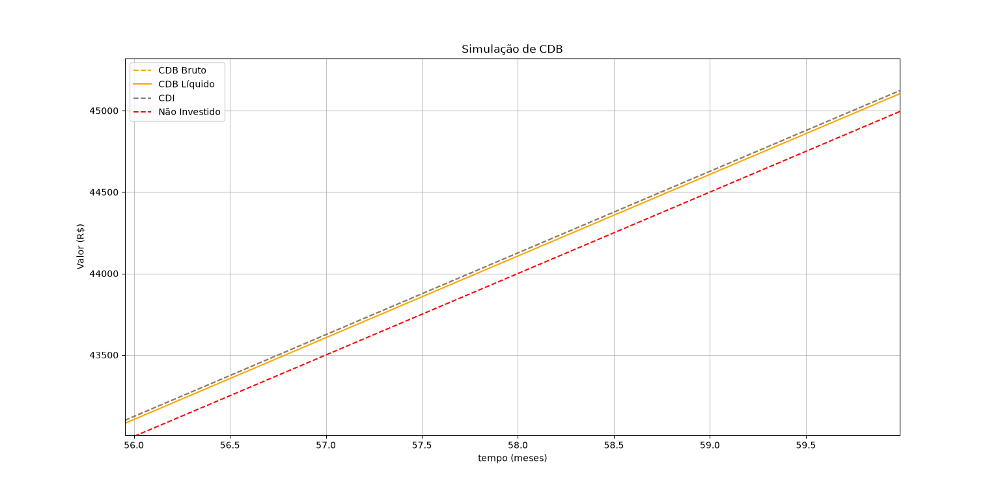

# Simulador de Investimentos atrelados ao CDI


Simulador de investimentos (CDB, LCI, LCA) atrelados ao CDI, com cálculo de IR regressivo e comparação de rendimento, projeto de estudo em Python, numpy e matplotlib.

## 📊 Exemplo de simulação

Simulação de um CDB (100% do CDI) com capital inicial de R$ 15.000, aportes mensais de R$ 500 e CDI de 14% a.a. ao longo de 5 anos, utilizando CDI variável modelado por um senoide:



## 📌 Descrição
Este projeto tem como objetivo praticar lógica de programação em Python, modularização de código e visualização de dados com matplotlib, utilizando como contexto uma simulação de investimentos atrelados ao CDI.

O foco do projeto é educacional, não sendo uma ferramenta de previsão ou recomendação de investimentos financeiros.

## 🚀 Funcionalidades
- Cálculo do montante bruto e líquido de LCI, LCA e CDB (antes e após IR)
- Comparação com o CDI
- Simulação do valor não investido (dinheiro parado)
- Geração de gráfico temporal comparando as opções

## 🎯 Objetivos do Projeto
- Aplicar conceitos de juros simples e compostos
- Trabalhar com séries temporais utilizando `numpy`
- Exercitar a modularização do código em funções e módulos
- Visualizar dados financeiros com `matplotlib`
- Simular o desconto automático de Imposto de Renda regressivo

Os detalhes matemáticos de cada cálculo (conversão de taxa, IR regressivo, montante com aportes) estão documentados em [`CONCEITOS.md`](CONCEITOS.md).

## 📁 Estrutura do Projeto
```bash
simulador-cdi/
│── main.py
│── README.md
│── requirements.txt
│── assets/
│   └── exemplo_simulacao.png
│── docs/
│   ├── conceitos.py
│   └── conceitos.pdf
│── src/
│   ├── calculos.py
│   ├── graficos.py
│   └── modelagem.py
└── notebooks/
    └── analises.ipynb
```

## 🚀 Como Executar

1. Instale as dependências:

```bash
pip install -r requirements.txt
```

2. Execute o simulador:

```bash
python main.py
```

3. Ou explore interativamente:

```bash
notebooks/analises.ipynb
```